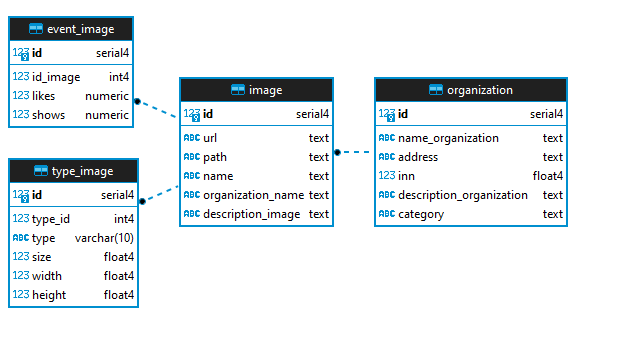

# Tестовое задание для участников отбора на стажировки «Кловери.Старт»
## Выполнин студент _SkillFactory_ Плюснин Олег

В развернутой БД используются следующие таблицы:
- __image__, таблица для хранения фотографий, состоит из следующих столбцов:
-- __id__, уникальный id таблицы, первичный ключ, тип ___serial___
-- __url__, url фотографии, если имеется ссылка на фото в сети, например, с сайта самой орг.культуры, тип ___text___
-- __path__, путь к фотографии в файловой системе БД, если фото будут храниться на диске, данный способ экономит ресурсы БД, но в случае с проблемами с диском файлы могут быть утеряны безвозвратно, тип ___text___. В таком случае фото лучше хранить в отдельном поле с типом ___blob___. Это увеличивает размер БД и время выполнения запросов, но пока существует БД, существуют и фотографии (данный способ не реализован в этой БД)
-- __name__, название фотографии, либо название конкретного объекта на фото, тип ___text___
-- __organization_name__, название организации культуры, где сделана фотография, тип ___text___, внешний ключ таблицы __organization__ поле __name_organization__
-- __description_image__, детальное описание фотографии, места съемки, объекта на фото, тип ___text___
- __organization__, таблица для хранения ининформации об организации культуры, состоит из следующих столбцов:
-- __id__, уникальный id таблицы, первичный ключ, тип ___serial___
-- __name_organization__, наименование организации культуры, тип ___text___
-- __address__, адрес организации культуры, тип ___text___
-- __inn__, ИНН организации культуры, тип ___real___
--__description_organization__, детальное описание организации культуры, тип ___text___
--__category__, категория организации культуры, в данной БД использована категория _кинотеатры_, тип ___text___
- __event_image__, таблица для хранения активности пользователей, состоит из следующих столбцов:
-- __id__, уникальный id таблицы, первичный ключ, тип ___serial___
-- __id_image__, id из таблицы image, внешний ключ, тип ___integer___
-- __likes__, количество лайков у фотографии, тип ___numeric___
-- __shows__, количество показов у фотографии, тип ___numeric___
- __type_image__, таблица для хранения технической информации о фотографии, состоит из следующих столбцов:
--  __id__, уникальный id таблицы, первичный ключ, тип ___serial___
-- __type_id__, id таблицы image, внешний ключ, тип ___integer___
-- __type__, тип файла(png, jpeg), тип ___varchar___
-- __size__, размер файла фото, тип ___real___
-- __width__, ширина фотографии в пикселях, тип ___real___
-- __height__, высота фотографии в пикселях, тип ___real___

В базе данных используются следующие индексы:
- ___organization_category___ в поле __category__ таблицы __organization__ для ускорения поиска по категории орг.культуры (кинотеатры, музеи)
- ___image_id___ поля __id__ таблицы __image__ для ускорения поиска по id фотографии
- ___image_name___ поля __name__ таблицы __image__ для ускорения поиска по названию фотографии или объекта
- ___image_organization_name___ поля  __organization_name__ таблицы __image__ для ускорения поиска по названию орг.культуры
- ___image_path___ поля __path__ таблицы __image__ для ускорения поиска пути файла в файловой системе

## Диаграмма БД


Данные для БД взяты с сайта министерства культуры с использованием API сайта. Для примера взяты данные по таким оргюкультуры, как кинотеатры (100 значений) /cinema/.

SQL-запрос на поиск фото, у которых есть хотя бы один лайк:
```sh
select path 
from 
image i 
join 
event_image ei on i.id=ei.id_image 
where likes>0
```


Работа находится на [GitHub]()
Дамп базы данных на [GooglDrive]()
Таблицы на [GooglDrive]()